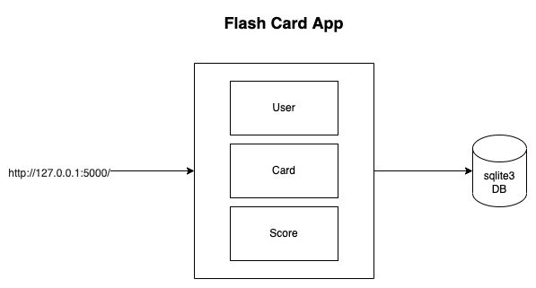
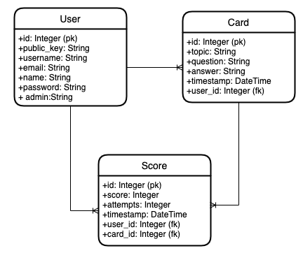

# Flash Card App

### Endpoint
> http://127.0.0.1:5000/

### User
> http://127.0.0.1:5000/user

### Card
> http://127.0.0.1:5000/card

### Score
> http://127.0.0.1:5000/score

## Architecture Diagram

## ER Diagram

## Usage

### virtual environment

* python3 -m pip install virtualenv 
* python3 -m virtualenv venv   
* source venv/bin/activate

### run app

* pip install -r requirements.txt
* sqlite3 cards.db
* flask db init
* flask db migrate -m "create tables"
* flask db upgrade
* flask run

## References

* https://flask.palletsprojects.com/en/2.1.x/
* https://www.sqlalchemy.org/
